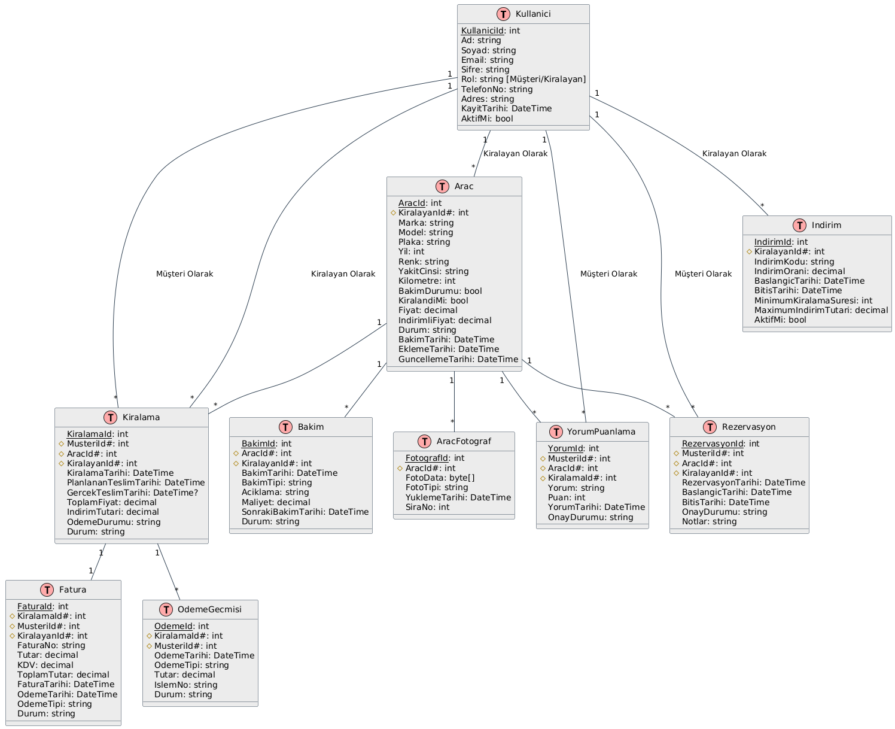
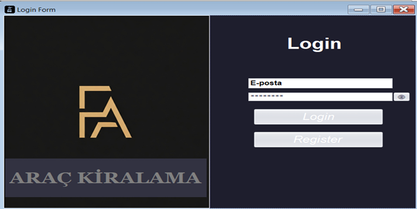
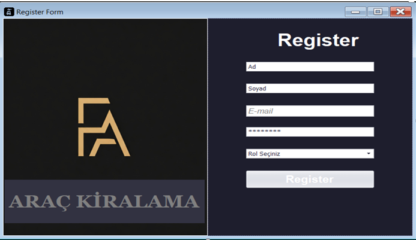
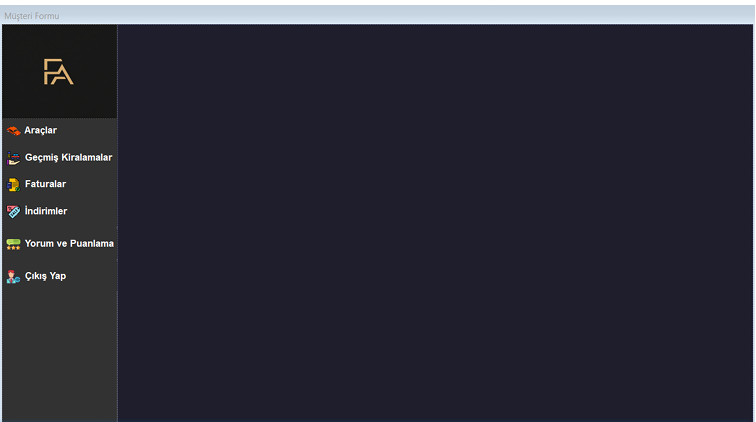
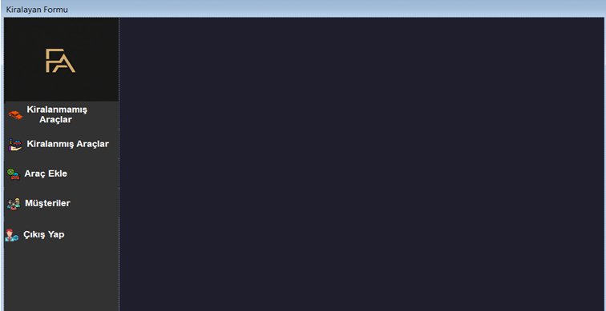
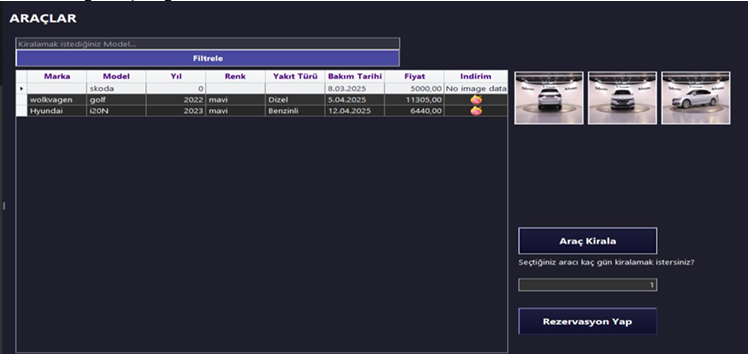
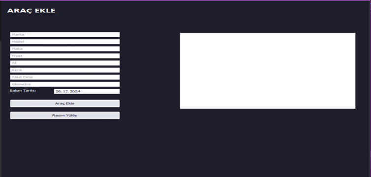
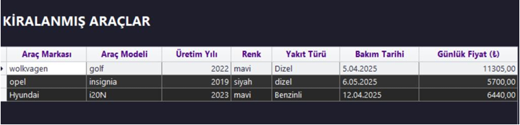
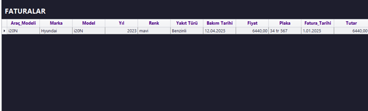

# 🚗 Araç Kiralama Otomasyonu

## 📌 Proje Açıklaması
Bu proje, **araç kiralama işlemlerini dijital bir platformda kolaylaştırmak** amacıyla geliştirilmiştir.  
Kullanıcılar sisteme giriş yaparak:  
- Araç rezervasyonu yapabilir,  
- Ödeme işlemlerini tamamlayabilir,  
- Araç kiralama geçmişine erişebilir.  

**Amaç:** Araç kiralama süreçlerini **hızlı, güvenilir ve kullanıcı dostu** bir şekilde sunmak ve tüm süreci **otomatikleştirmektir**.

---

## 🛠 Kullanılan Teknolojiler
- **Programlama Dili:** C#  
- **Veritabanı Yönetim Sistemi:** Microsoft SQL Server  
- **Geliştirme Ortamı:** Visual Studio  
- **Arayüz:** Windows Forms + DevExpress  
- **ORM:** Entity Framework 6.0  

---

## 🏗 Proje Mimarisi
Proje **katmanlı mimari** ile geliştirilmiştir:  

- **Sunum Katmanı (UI):** Windows Forms + DevExpress  
- **İş Mantığı Katmanı (BLL):** `AracService`, `KiralamaService`, `KullaniciService` vb. servisler  
- **Veri Erişim Katmanı (DAL):** `AracKiralamaContext` + Entity Framework  

### 📋 Class Diyagramı

### 🗄️ Veritabanı (ER Diyagramı)

---

## 💻 Arayüz Görselleri

### 🔑 Kullanıcı İşlemleri
- **Giriş Ekranı**  
  

- **Kayıt Ekranı**  
  

- **Müşteri Paneli**  
  

- **Kiralayan Paneli**  
  

---

### 🚘 Araç İşlemleri
- **Araçlar Listesi**  
  

- **Araç Ekleme**  
  

- **Kiralanmış Araçlar**  
  

- **Kiralanmamış Araçlar**  
  

---

### 📑 Diğer Modüller
- **Faturalar**  
  

- **İndirimler**  
  

- **Yorumlar**  
  

---

## ⚙️ Kurulum
1. Projeyi indirin veya klonlayın.  
2. Visual Studio üzerinde projeyi açın.  
3. MsSQL üzerinde **Entity Framework Code-First** ile veritabanını oluşturun.  
4. Gerekli **NuGet paketlerini yükleyin**.  
5. `.sln` dosyasını çalıştırarak projeyi başlatın.  

---

## 👨‍💻 Geliştirici
**Faruk AYDIN**
